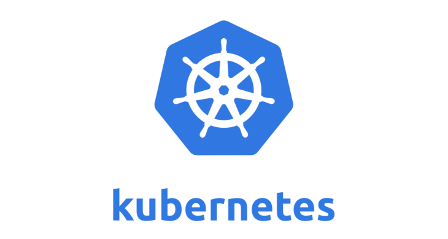
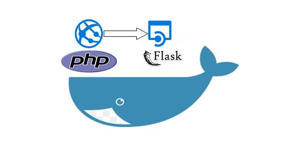

## Presentation
My name is Augustin Renard, I am a skilled Data Scientist and Data Engineer with a clear aspiration to transition into the role of a Software DevOps Engineer. My professional journey has equipped me with a diverse skill set that spans backend development in Python, Docker, and Airflow, to front-end expertise in JavaScript, Vue.js, and Bootstrap. I possess a strong analytical mindset and have excelled in computer vision technologies like OpenCV and Mediapipe. My academic background includes a Bachelor's degree in Information Technology from HEC Montreal, supplemented by certificates in Data Science and Statistics from HarvardX and AWS certifications.

In my professional experience, I have thrived as a Data Scientist and Data Engineer at Bell Canada, where I harnessed Docker, Python, and machine learning to automate and optimize data processing tasks, significantly reducing processing times. My tenure as a Full Stack Web Developer at Services iNSiTU inc showcased my proficiency in streamlining business operations and designing robust architectures, while my experience as a Junior Python Developer at DNEG Montreal allowed me to lead Python version migrations and provide technical support to colleagues. With a passion for technology and a strong foundation in software development and data engineering, I am poised to excel in the role of a Software DevOps Engineer, driving innovation and efficiency in software development processes.

## Education
### [HarvardX (EdX) - CS109x: Introduction to Data Science with Python](https://www.harvardonline.harvard.edu/course/introduction-data-science-python)
#### Grade: 100% - A
#### Course Outline:
- Linear Regression
- Multiple and Polynomial Regression
- Model Selection and Cross-Validation
- Bias, Variance, and Hyperparameters
- Classification and Logistic Regression
- Multi-logstic Regression and Missingness
- Bootstrap, Confidence Intervals, and Hypothesis Testing
- Capstone Project

### [HEC Montreal - Bachelor Business Administration / IT Specialisation](https://www.hec.ca/etudiants/mon-programme/baa/specialisations/specialisation-analyse-affaires-technologie-information.html)
#### Grade: 3.0
#### Program Outline:
- Python Introduction
- Web Development Introduction
- DataBase management
- Java Introduction
- Analytics and Statistics for business analysis
- Machine learning
- UI/UX
- Team work and management

## Projects

### [Project - Wordpress Deployment -  KUBERNETES](https://github.com/Augmaster/Augmaster.github.io/tree/main/Projects/MiniProject-Docker)
#### Overview
In my recent DevOps training project, I successfully deployed a WordPress website on Kubernetes following a structured approach. The process involved creating a reliable MySQL deployment with a single replica and setting up a ClusterIP service to expose the MySQL pods internally. For the WordPress deployment, I configured the necessary environment variables to establish a connection with the MySQL database. To ensure data persistence, I implemented volume mounting. Additionally, I created a NodePort service to expose the WordPress frontend externally, enabling seamless user access.

#### The technologies I used: 
* Kubernetes (K8s): Orchestrated the deployment, scaling, and management of containers.
* MySQL: Utilized for the database backend of the WordPress website.
* Persistent Volumes (PV): Implemented to ensure data persistence across pod restarts.
* Deployment YAML: Defined configurations for MySQL and WordPress deployments.
* Service YAML: Configured ClusterIP service for MySQL and NodePort service for WordPress frontend access.

### [Project - Student List App Deployment -  DOCKER](https://github.com/Augmaster/Augmaster.github.io/tree/main/Projects/MiniProject-Docker)
#### Overview
The student-list project involves building a proof of concept (POC) for POZOS, a French IT company, to demonstrate the use of Docker for creating a decoupled infrastructure. The application, student_list, comprises a REST API and a web app written in HTML + PHP, both housed in separate containers. The objective is to improve deployment processes, implement versioning, follow best practices in Docker infrastructure, and employ Infrastructure as Code (IAC) principles.

#### The technologies I used: 
* PHP: Powering the web app for end-user interaction.
* Flask (Python): Creating the REST API with basic authentication.
* Docker: Utilized for containerization of both modules.
* Centos 7.6 OS: Recommended operating system for deployment.
* Docker Compose: Orchestrating the deployment of API and web app containers.
* Docker Registry: Setting up a private registry to store built Docker images.
* Python:2.7-stretch: Base image for building the API container.
* Flask Packages: Various packages including Flask, Flask HTTPAuth, Flask SimpleLDAP, and others, necessary for the API.
* Portus/Web Interface: Options for managing and viewing pushed images in the private registry.

### [Project - Wireless Volume Control - COMPUTER VISION](https://github.com/Augmaster/Augmaster.github.io/tree/main/Projects/WirelessVolumeChange)
#### Overview
The project uses a camera to track hand movements and gestures in real-time.It allows users to control their computer's volume by performing specific hand gestures.For example, getting your fingers closer can increase the volume while bringing spacing them can decrease it. The wireless nature of the project means that users can adjust their volume from a distance without having to touch their computer.
This technology could be applied to various other applications, such as smart home devices or gaming interfaces, making it a potentially useful addition to everyday life.

[MediaPipe - Hand Tracking](https://developers.google.com/mediapipe/solutions/vision/hand_landmarker)

#### The technologies I used: 
* OpenCV to process the camera input, detecting and tracking the hand movements.
* Mediapipe  to estimate the hand landmarks, providing accurate data for gesture recognition.
* Numpy for data processing and manipulation, allowing for efficient calculation of gesture characteristics.
* Osascript to control the volume of the computer (MAC).

### [Project - Emotion detection Wine reviews - NATURAL LANGUAGE PROCESSING](https://www.kaggle.com/augustinrenard/emotion-detection-wine-review/edit)
#### Overview
The goal of this project was to develop an emotion detection model to categorize wine reviews as positive, neutral, or negative. The dataset used was a wine review database containing thousands of reviews, and two models were utilized for the analysis: Vadors and Roberta. Both models are pre-trained on large datasets and have been shown to perform well in NLP tasks such as sentiment analysis.
This project demonstrates the effectiveness of NLP techniques for emotion detection in wine reviews. The combination of lexicon-based and transformer-based models allowed for a comprehensive analysis of the emotional tone of the text. The high accuracy of the models suggests that they could be applied to other datasets with similar characteristics. Future work could involve exploring the use of additional models and fine-tuning the existing models to improve their performance.

[Hugging face Roberta model](https://huggingface.co/docs/transformers/model_doc/roberta)

#### The technologies I used: 
* Pandas for data manipulation and analysis, especially for tabular data.
* NumPy for numerical computing, especially for scientific and mathematical calculations.
* Vadors model for lexicon-based sentiment analysis tool used to categorize text as positive, neutral, or negative based on a dictionary of words and their associated sentiment scores.
* Roberta model for transformer-based language model used for natural language processing tasks such as text classification and sentiment analysis.
* Kaggle  for the datasets, and collaborating with other data scientists.
* Seaborn for creating attractive and informative statistical graphics.

### [Project - Sleep forcasting - Rob Mulla Competition(Youtuber/Streamer) - MACHINE LEARNING](https://www.kaggle.com/competitions/kaggle-pog-series-s01e04)
#### Overview
The goal of this project was to develop a sleep forcasting model to predict futur sleep hours of the famous streamer/youtuber Rob Mulla. The dataset used was a number of hours of sleep for the past 4-5 years as well as some raw data from the application he used, such as steps of the day etc. 

For the first try I used an XGBRegressor model without much parameter tunning or cross validation and ended up having a score of 0.95113 which led me to 134/142 people participating: https://www.kaggle.com/code/augustinrenard/predict-rob-sleep-time

For the second attempt I reused XBGRegressor model but this time with a little more parameter tunning, a cross validation and a bit more exploratory data analysis and features development. I ended up finishing 63/142 with a score of 0.67656: https://www.kaggle.com/code/augustinrenard/predict-time-sleep-simple-method

Finaly I used the Facebook famous model Prophet but the results were not as good as XGBRegressor model. 

#### The technologies I used: 
* Pandas for data manipulation and analysis, especially for tabular data.
* NumPy for numerical computing, especially for scientific and mathematical calculations.
* XGBRegressor model for predicting continuous numerical values in various fields, such as finance, healthcare, and marketing.
* FB Prophet model for predicting future values of a given time series based on historical trends and patterns.
* Kaggle  for the datasets, and collaborating with other data scientists.
* Seaborn for creating attractive and informative statistical graphics.

### [Project - Bitcoin Trend Sentiment Predicter - MACHINE LEARNING](https://github.com/Augmaster/Augmaster.github.io/tree/main/Projects/BitcoinSentimentPredicter)
#### Overview
The project is a bitcoin price predictor that utilizes the sentiment analysis of comments made on Wikipedia edits related to bitcoin. The project predicts the trend and popularity of bitcoin for the next day, indicating whether the price will increase or decrease. It uses natural language processing techniques to analyze the sentiment of comments and assess the mood of the community surrounding bitcoin. This information is then used to train a machine learning model that can accurately predict future trends in the bitcoin market. The end result is a tool that can help investors make informed decisions about their investments in bitcoin.

I managed to improve the accuracy of the model up to 53% but there is a lot of improvment that can be done such as adding more features from tweets, articles and news that we can scrap online, but also by adding some other financial indicators such as inflation rate, GDP growth rate, etc.

#### The technologies I used: 
* Pandas for data manipulation and analysis, especially for tabular data.
* NumPy for numerical computing, especially for scientific and mathematical calculations.
* XGBRegressor model for predicting continuous numerical values in various fields, such as finance, healthcare, and marketing.
* Hugging Face Sentiment Pipeline to analyze and understand the sentiment of large volumes of text data, such as social media posts, customer feedback, and product reviews.
* Mwclient for the datasets from wikipedia
* Yfinance to get the Bitcoin closing prices

### [Project - Speech Recognition to transcript in multi-languages - NATURAL LANGUAGE PROCESSING](https://github.com/Augmaster/Augmaster.github.io/tree/main/Projects/SpeechRecognitionEmotionAnalyser)
#### Overview
This project is based on Natural Language Processing and translation. This tool can efficiently generate transcripts from various sources such as live speeches, YouTube videos, and downloaded video files. With its multi-language support, it can provide accurate translations of different languages, making it an essential tool for translating live events, YouTube videos, classes, and other content that requires fast and detailed transcription. This project has potential to provide an efficient and reliable transcription service and makes it a valuable resource for individuals and organizations looking to reach a global audience.

This project is still on going and here is a road-map for the development:
- Add live speech recogntion
- Integrate a GUI from customtkinter
- Integrate in the GUI a way of chaning modes (youtube, live speach, downloaded video)
- In the GUI add features to change languages, modes, interfaces and themes
- Good feature could be to analyse the sentences sentiment and do an estimation of the total speech emotion score

#### The technologies I used: 
* Nltk to tokenize the transcript
* Pandas for data manipulation and analysis, especially for tabular data.
* NumPy for numerical computing, especially for scientific and mathematical calculations.
* Assenbly AI for the online transcription through the API
* GoogleTranslator library for the fast translation using google's API
* Pytube for downloading youtube videos

## Certifications
### [The Ultimate DevOps Bootcamp - 2023](https://www.udemy.com/certificate/UC-fe226cb8-800f-4725-86ef-e6efd245dc07/?utm_source=sendgrid.com&utm_medium=email&utm_campaign=email)
### [Masterclass Python | Algorithms and data processing](https://www.udemy.com/certificate/UC-da4b6a0e-b31c-419c-8bc1-bb625fdf6845/?utm_medium=email&utm_campaign=email&utm_source=sendgrid.com)
### [AWS Certified Developer - Associate](https://www.credly.com/badges/696e7ce0-e0e6-4c26-bb31-90e268741af8/public_url)
### [The web developer bootcamp 2022](https://www.udemy.com/certificate/UC-d3981853-f340-44a6-a414-342c181b024b/)
### [AWS Certifided Cloud Practionner](https://www.credly.com/badges/5e654fb4-f342-4ebc-a9f5-b0cd9b05eb95/public_url)

